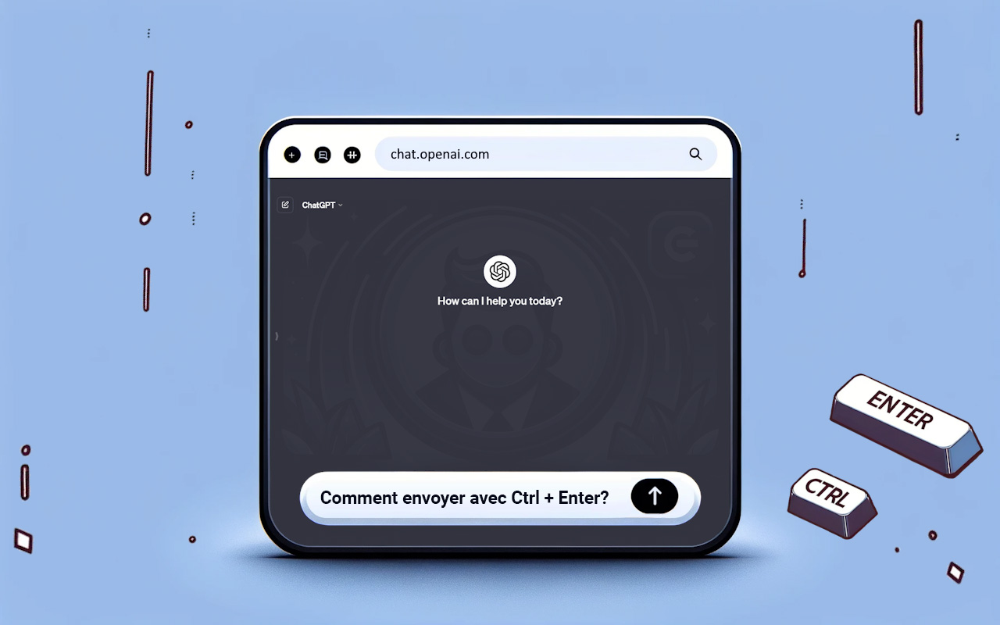

#  ChatGPT EnterControl

## Description

ChatGPT EnterControl est une extension du navigateur Google Chrome qui améliore l'interaction avec ChatGPT. Elle vous permet de créer de nouvelles lignes en utilisant Enter ou Shift+Enter et d'envoyer des messages en utilisant Ctrl+Enter.

## Caractéristiques

- **Saut de ligne avec Enter ou Shift+Enter** : Créez facilement de nouvelles lignes sans envoyer de message.
- **Envoyer des messages avec Ctrl+Enter** : Évitez les envois accidentels et contrôlez le processus.

## Installation
1. Téléchargez l'extension depuis le [ Chrome Web Store](https://chromewebstore.google.com/detail/ChatGPT-EnterControl).
2. Activez l'extension dans votre navigateur  Chrome.
3. Ouvrez le chat  ChatGPT et profitez de ses fonctionnalités pratiques.

## Compatibilité

L'extension est développée pour les dernières versions du navigateur Chrome en utilisant la Version 3 du Manifeste.

## Support linguistique

Pour voir la description dans d'autres langues, sélectionnez la langue requise ci-dessous :

- [ العربية](./README_AR.md)
- [ Deutsch](./README_DE.md)
- [ English](../../README.md)
- [ Español](./README_ES.md)
- [ فارسی](./README_FA.md)
- [ Français](./README_FR.md)
- [ हिन्दी](./README_HI.md)
- [ Italiano](./README_IT.md)
- [ 日本語](./README_JA.md)
- [ 한국어](./README_KO.md)
- [ Português](./README_PT.md)
- [ Русский](./README_RU.md)
- [ 中文](./README_ZH.md)
- [ Türkçe](./README_TR.md)
- [ Українська](./README_UK.md)
- [ اردو](./README_UR.md)
- [ Tiếng Việt](./README_VI.md)

## Licence

Ce projet est distribué sous une double licence : [Licence MIT](../../LICENSE_MIT) et [Creative Commons Attribution 4.0 International (CC BY 4.0)](../../LICENSE_CC_BY_4.0). Cela signifie que lors de l'utilisation, de la copie, de la modification et de la distribution du projet, vous devez respecter les termes des deux licences. En particulier, vous devez créditer l'auteur conformément aux exigences de CC BY tout en adhérant également aux libertés fournies par la Licence MIT.
