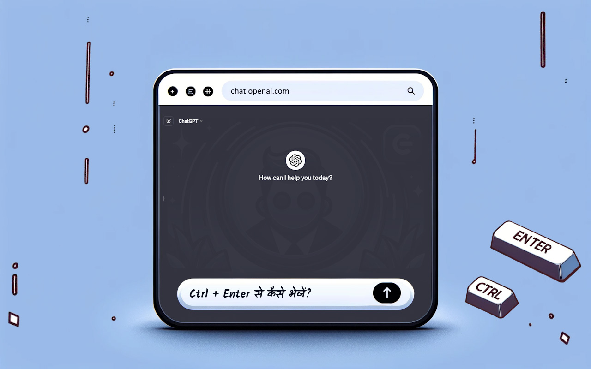

#  ChatGPT 

## विवरण

ChatGPT EnterControl एक Google Chrome ब्राउज़र एक्सटेंशन है जो ChatGPT के साथ इंटरैक्शन को बेहतर बनाता है। यह आपको Enter या Shift+Enter का उपयोग करके नई पंक्तियाँ बनाने और Ctrl+Enter का उपयोग करके संदेश भेजने की अनुमति देता है।

## विशेषताएँ

- **Enter या Shift+Enter के साथ लाइन ब्रेक**: बिना संदेश भेजे आसानी से नई पंक्तियाँ बनाएं।
- **Ctrl+Enter के साथ संदेश भेजें**: गलती से संदेश भेजने से बचें और प्रक्रिया को नियंत्रित करें।

## स्थापना
1. [ Chrome वेब स्टोर](https://chromewebstore.google.com/detail/ChatGPT-EnterControl) से एक्सटेंशन डाउनलोड करें।
2. अपने  Chrome ब्राउज़र में एक्सटेंशन सक्रिय करें।
3.  ChatGPT चैट खोलें और सुविधाजनक सुविधाओं का आनंद लें।

## संगतता

यह एक्सटेंशन Chrome ब्राउज़र के नवीनतम संस्करणों के लिए Manifest Version 3 का उपयोग करके विकसित किया गया है।

## भाषा समर्थन

अन्य भाषाओं में विवरण देखने के लिए, नीचे दी गई भाषा चुनें:

- [ العربية](./README_AR.md)
- [ Deutsch](./README_DE.md)
- [ English](../../README.md)
- [ Español](./README_ES.md)
- [ فارسی](./README_FA.md)
- [ Français](./README_FR.md)
- [ हिन्दी](./README_HI.md)
- [ Italiano](./README_IT.md)
- [ 日本語](./README_JA.md)
- [ 한국어](./README_KO.md)
- [ Português](./README_PT.md)
- [ Русский](./README_RU.md)
- [ 中文](./README_ZH.md)
- [ Türkçe](./README_TR.md)
- [ Українська](./README_UK.md)
- [ اردو](./README_UR.md)
- [ Tiếng Việt](./README_VI.md)

## लाइसेंसिंग

यह परियोजना दोहरे लाइसेंस के अंतर्गत वितरित की गई है: [MIT लाइसेंस](../../LICENSE_MIT) और [Creative Commons Attribution 4.0 International (CC BY 4.0)](../../LICENSE_CC_BY_4.0). इसका अर्थ है कि परियोजना का उपयोग, प्रतिलिपि, संशोधन, और वितरण करते समय, आपको दोनों लाइसेंसों की शर्तों का पालन करना होगा। विशेष रूप से, आपको CC BY की आवश्यकताओं के अनुसार लेखकीय साख का उल्लेख करना होगा जबकि MIT लाइसेंस द्वारा प्रदान की गई स्वतंत्रताओं का भी पालन करना होगा।
