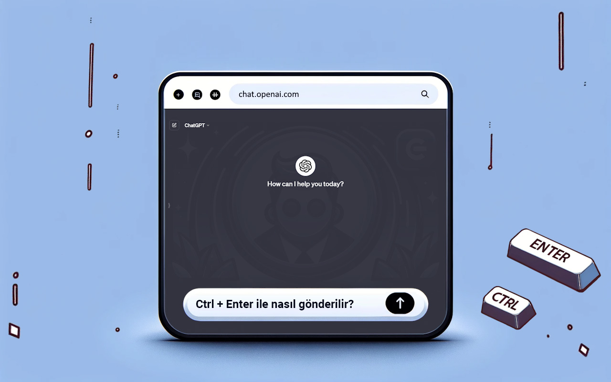

#  ChatGPT EnterControl

## Açıklama

ChatGPT-EnterControl, Google Chrome tarayıcı uzantısıdır ve ChatGPT ile etkileşimi artırır. Enter veya Shift+Enter kullanarak yeni satırlar oluşturmanıza ve Ctrl+Enter ile mesaj göndermenize olanak tanır.

## Özellikler

- **Enter veya Shift+Enter ile satır kırma**: Mesaj göndermeden rahatça yeni satırlar oluşturun.
- **Ctrl+Enter ile mesaj gönderme**: Kazara gönderimleri önleyin ve süreci kontrol edin.

## Kurulum
1. Uzantıyı [ Chrome Web Mağazası](https://chromewebstore.google.com/detail/ChatGPT-EnterControl)'ndan indirin.
2.  Chrome tarayıcınızda uzantıyı etkinleştirin.
3.  ChatGPT sohbetini açın ve kullanışlı özelliklerin keyfini çıkarın.

## Uyumluluk

Uzantı, Manifest Sürüm 3 kullanılarak Chrome tarayıcısının en son sürümleri için geliştirilmiştir.

## Dil Desteği

Diğer dillerdeki açıklamayı görmek için aşağıdan gerekli dili seçin:

- [ العربية](./README_AR.md)
- [ Deutsch](./README_DE.md)
- [ English](../../README.md)
- [ Español](./README_ES.md)
- [ فارسی](./README_FA.md)
- [ Français](./README_FR.md)
- [ हिन्दी](./README_HI.md)
- [ Italiano](./README_IT.md)
- [ 日本語](./README_JA.md)
- [ 한국어](./README_KO.md)
- [ Português](./README_PT.md)
- [ Русский](./README_RU.md)
- [ 中文](./README_ZH.md)
- [ Türkçe](./README_TR.md)
- [ Українська](./README_UK.md)
- [ اردو](./README_UR.md)
- [ Tiếng Việt](./README_VI.md)

## Lisanslama

Bu proje, çift lisans altında dağıtılmaktadır: [MIT Lisansı](../../LICENSE_MIT) ve [Creative Commons Attribution 4.0 International (CC BY 4.0)](../../LICENSE_CC_BY_4.0). Bu, projeyi kullanırken, kopyalarken, değiştirirken ve dağıtırken her iki lisansın şartlarına uymak zorunda olduğunuz anlamına gelir. Özellikle, CC BY'nin gerekliliklerine uygun olarak yazarlık kredisi vermeniz ve aynı zamanda MIT Lisansı tarafından sağlanan özgürlüklere uymalısınız.
