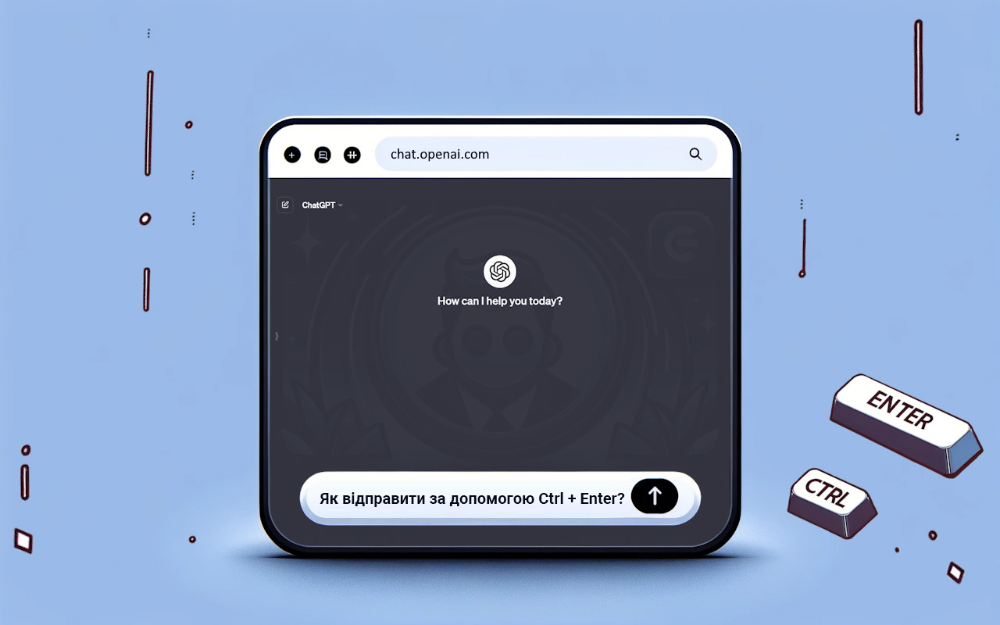

#  ChatGPT EnterControl

## Опис

ChatGPT EnterControl - це розширення браузера Google Chrome, яке покращує взаємодію з ChatGPT. Воно дозволяє створювати нові рядки за допомогою клавіш Enter або Shift+Enter та відправляти повідомлення, використовуючи Ctrl+Enter.

## Особливості

- **Перехід на новий рядок за допомогою Enter або Shift+Enter**: Зручно створюйте нові рядки без відправлення повідомлення.
- **Відправлення повідомлень за допомогою Ctrl+Enter**: Уникайте випадкових відправлень та контролюйте процес.

## Встановлення
1. Завантажте розширення з [ Chrome Web Store](https://chromewebstore.google.com/detail/ChatGPT-EnterControl).
2. Активуйте розширення у вашому браузері  Chrome.
3. Відкрийте чат  ChatGPT та насолоджуйтеся зручними функціями.

## Сумісність

Розширення розроблено для останніх версій браузера Chrome з використанням Маніфесту Версії 3.

## Підтримка мов

Щоб переглянути опис іншими мовами, оберіть потрібну мову нижче:

- [ العربية](./README_AR.md)
- [ Deutsch](./README_DE.md)
- [ English](../../README.md)
- [ Español](./README_ES.md)
- [ فارسی](./README_FA.md)
- [ Français](./README_FR.md)
- [ हिन्दी](./README_HI.md)
- [ Italiano](./README_IT.md)
- [ 日本語](./README_JA.md)
- [ 한국어](./README_KO.md)
- [ Português](./README_PT.md)
- [ Русский](./README_RU.md)
- [ 中文](./README_ZH.md)
- [ Türkçe](./README_TR.md)
- [ Українська](./README_UK.md)
- [ اردو](./README_UR.md)
- [ Tiếng Việt](./README_VI.md)

## Ліцензування

Цей проект розповсюджується під подвійною ліцензією: [MIT License](../../LICENSE_MIT) та [Creative Commons Attribution 4.0 International (CC BY 4.0)](../../LICENSE_CC_BY_4.0). Це означає, що при використанні, копіюванні, модифікації та розповсюдженні проекту ви повинні дотримуватися умов обох ліцензій. Зокрема, ви повинні вказувати авторство відповідно до вимог CC BY, а також дотримуватися свобод, наданих MIT License.
