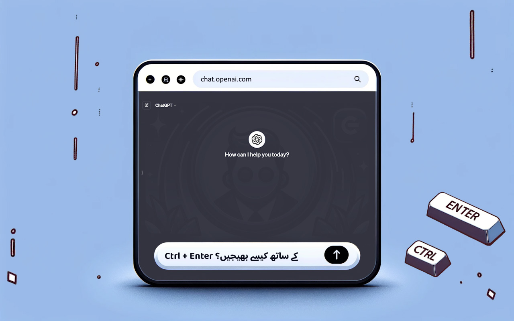

#  ChatGPT 

## تفصیل

ChatGPT EnterControl ایک Google Chrome براؤزر کی توسیع ہے جو ChatGPT کے ساتھ تعامل کو بہتر بناتی ہے۔ یہ آپ کو Enter یا Shift+Enter کا استعمال کرتے ہوئے نئی لائنیں بنانے اور Ctrl+Enter کے ذریعے پیغامات بھیجنے کی سہولت دیتی ہے۔

## خصوصیات

- **Enter یا Shift+Enter کے ساتھ لائن بریک**: پیغام بھیجے بغیر آسانی سے نئی لائنیں بنائیں۔
- **Ctrl+Enter کے ساتھ پیغامات بھیجیں**: غلطی سے پیغامات بھیجنے سے بچیں اور عمل کو کنٹرول کریں۔

## نصب کرنا
1. [ Chrome ویب اسٹور](https://chromewebstore.google.com/detail/ChatGPT-EnterControl) سے توسیع ڈاؤن لوڈ کریں۔
2. اپنے  Chrome براؤزر میں توسیع کو فعال کریں۔
3.  ChatGPT چیٹ کھولیں اور آسان خصوصیات سے لطف اندوز ہوں۔

## مطابقت

یہ توسیع Chrome براؤزر کے تازہ ترین ورژنز کے لئے Manifest ورژن 3 کا استعمال کرتے ہوئے تیار کی گئی ہے۔

## زبان کی مدد

دوسری زبانوں میں تفصیل دیکھنے کے لیے نیچے دی گئی زبان منتخب کریں:

- [ العربية](./README_AR.md)
- [ Deutsch](./README_DE.md)
- [ English](../../README.md)
- [ Español](./README_ES.md)
- [ فارسی](./README_FA.md)
- [ Français](./README_FR.md)
- [ हिन्दी](./README_HI.md)
- [ Italiano](./README_IT.md)
- [ 日本語](./README_JA.md)
- [ 한국어](./README_KO.md)
- [ Português](./README_PT.md)
- [ Русский](./README_RU.md)
- [ 中文](./README_ZH.md)
- [ Türkçe](./README_TR.md)
- [ Українська](./README_UK.md)
- [ اردو](./README_UR.md)
- [ Tiếng Việt](./README_VI.md)

## لائسنسنگ

یہ پروجیکٹ دوہرے لائسنس کے تحت تقسیم کیا گیا ہے: [MIT لائسنس](../../LICENSE_MIT) اور [Creative Commons Attribution 4.0 International (CC BY 4.0)](../../LICENSE_CC_BY_4.0)۔ اس کا مطلب ہے کہ جب آپ پروجیکٹ کو استعمال، کاپی، ترمیم، اور تقسیم کرتے ہیں، تو آپ کو دونوں لائسنسز کی شرائط کی پاسداری کرنی ہوگی۔ خاص طور پر، آپ کو CC BY کی ضروریات کے مطابق مصنف کی حوالہ دینا ہوگا جبکہ MIT لائسنس کی فراہم کردہ آزادیوں کی بھی پاسداری کرنی ہوگی۔
